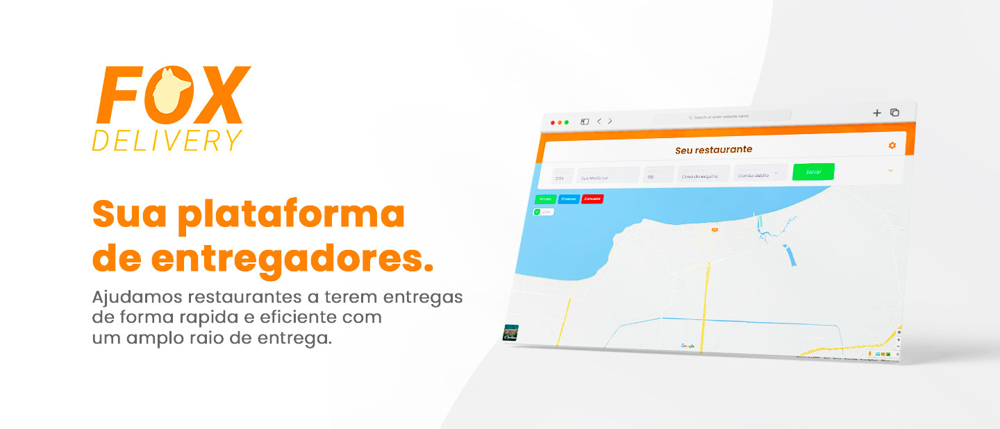

<!---Esses são exemplos. Veja https://shields.io para outras pessoas ou para personalizar este conjunto de escudos. Você pode querer incluir dependências, status do projeto e informações de licença aqui--->

> A Fox Delivery irá fornecer ao seu restaurante a facilidade de
obter motoboys, a todo momento. A plataforma vai direcionar os entregadores que
estiverem mais próximos para fazer a sua entrega com agilidade.

## 🛠️ Linguagens

* Node.js
* React.js
* React Native
* HTML, CSS, JS
* Typescript
* MySQL

## 👨‍💻 Especificações do Projeto

Para ver todas as partes técnicas do projeto acesse a aba [Wiki](https://github.com/DionatanLM/FoxDelivery/wiki)

## ⚙️ Ajustes e melhorias

O projeto ainda está em desenvolvimento e as próximas atualizações serão voltadas nas seguintes tarefas:

- [x] Ideia
- [x] Prototipo
- [ ] Aplicação web
- [ ] Aplicação Mobile
- [ ] Teste de Software
- [ ] Conclusão do projeto

## 🤝 Colaboradores

Agradecemos às seguintes pessoas que contribuíram para este projeto:

<table>
  <tr>
    <td align="center">
      <a href="https://github.com/DionatanLM" target="_blank">
         
        
          <b>Dionatan de Lima</b>
        
      </a>
    </td>
    <td align="center">
      <a href="https://github.com/gabrielhz" target="_blank">
         
        
          <b>Gabriel Ramos</b>
        
      </a>
    </td>
  </tr>
</table>

## 📝 Licença

Esse projeto está sob licença. Veja o arquivo [LICENÇA](LICENSE.md) para mais detalhes.

[⬆ Voltar ao topo](#nome-do-projeto) 
